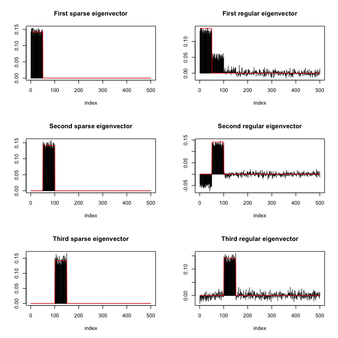

<!-- README.md is generated from README.Rmd. Please edit that file -->


This package provides functions to compute sparse eigenvectors (while keeping their orthogonality) or sparse PCA from either the covariance matrix or directly the data matrix.


## Installation

```r
# Installation from local file
install.packages(file.choose(), repos = NULL, type="source")

# Or from GitHub
# install.packages("devtools")
devtools::install_github("dppalomar/sparseEigen")

# Get help
library(sparseEigen)
help(package="sparseEigen")
?spEigen
```


## Usage of `spEig()`

The following is a simple illustrative example.

We start by loading the package and generating synthetic data with sparse eigenvectors:

```r
library(sparseEigen)
set.seed(42)

# parameters 
m <- 500  # dimension
n <- 100  # number of samples
q <- 3  # number of sparse eigenvectors to be estimated
sp_card <- 0.1*m  # cardinality of each sparse eigenvector
rho <- 0.5  # sparsity level

# generate non-overlapping sparse eigenvectors
V <- matrix(rnorm(m^2), ncol = m)
tmp <- matrix(0, m, q)
for (i in 1:max(q, 2)) {
  ind1 <- (i - 1)*sp_card + 1
  ind2 <- i*sp_card
  tmp[ind1:ind2, i] = 1/sqrt(sp_card)
  V[, i] <- tmp[, i]
}
# keep first q eigenvectors the same (already orthogonal) and orthogonalize the rest
V <- qr.Q(qr(V))  

# generate eigenvalues
lmd <- rep(1, m)
lmd[1:q] <- 100*seq(from = q, to = 1)

# generate covariance matrix from sparse eigenvectors and eigenvalues
R <- V %*% diag(lmd) %*% t(V)

# generate data matrix from a zero-mean multivariate Gaussian distribution 
# with the constructed covariance
X <- MASS::mvrnorm(n, rep(0, m), R)  # random data with underlying sparse structure
```
Then, we estimate the covariance matrix with `cov(X)` and compute its sparse eigenvectors:

```r
# computation of sparse eigenvectors
res_standard <- eigen(cov(X))
res_sparse <- spEigen(cov(X), q, rho)
```

We can assess how good the estimated eigenvectors are by computing the inner product with the original eigenvectors (the closer to 1 the better):

```r
# show inner product between estimated eigenvectors and originals
abs(diag(t(res_standard$vectors) %*% V[, 1:q]))  #for standard estimated eigenvectors
#> [1] 0.9726306 0.9488030 0.9623054
abs(diag(t(res_sparse$vectors) %*% V[, 1:q]))    #for sparse estimated eigenvectors
#> [1] 0.9992796 0.9985397 0.9967846
```

Finally, the following plot shows the sparsity pattern of the eigenvectors (sparse computation vs. classical computation):
<!-- -->

## Usage of `spEigenCov()`

The function `spEigenCov()` requires a full-rank covariance matrix. Therefore, we generate data as previously with the only difference that we set the number of samples to be `600`.


Then, we compute the covariance matrix through the joint estimation of sparse eigenvectors and eigenvalues:

```r
# computation of covariance matrix
res_sparseCov <- spEigenCov(cov(X), q, rho)
```

Again, we can assess how good the estimated eigenvectors are by computing the inner product with the original eigenvectors:

```r
# show inner product between estimated eigenvectors and originals
abs(diag(t(res_sparseCov$vectors[, 1:q]) %*% V[, 1:q]))    #for sparse estimated eigenvectors
#> [1] 0.9998862 0.9997517 0.9995271
```

Finally, we can compute the RMSE of the estimated covariance matrix:

```r
# show RMSE between estimated and true covariance 
norm(cov(X) - R, type = 'F') #for sample covariance matrix
#> [1] 42.60926
norm(res_sparseCov$cov - R, type = 'F') #for covariance with sparse eigenvectors
#> [1] 28.57147
```


